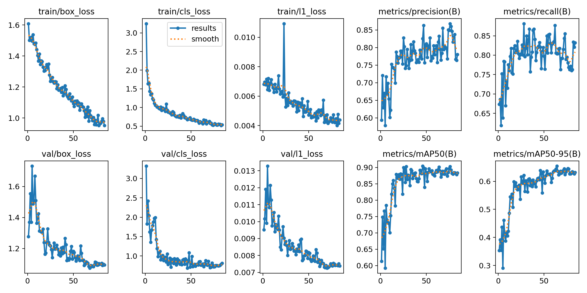

# Computer-Vision-For-Salmon-Aquaculture
Computer vision for salmon aquaculture using YOLO26 and ByteTrack: object detection, instance segmentation, and multi-object tracking, with Google Colab experiments and model evaluation.
# Computer Vision for Salmon

Detection, instance segmentation, and multi-object tracking of farmed
salmon using YOLO26 and ByteTrack.

This project investigates how computer vision can extract fish-level
observations from underwater aquaculture footage. It covers dataset
preparation, transfer learning, model evaluation, and video inference
through Google Colab notebooks.

## Project overview

Two models were developed:

- **Object detection:** YOLO26s trained to detect salmon using the
  Healthy and Loser Salmon dataset.
- **Instance segmentation:** YOLO26s-seg trained on a custom polygon
  dataset annotated using Ultralytics Platform.

Both models were integrated with ByteTrack for short-term tracking
across video frames.

The project is a proof of concept. It does not yet estimate physical
biomass, diagnose health conditions, or provide validated farm
management recommendations.

## My contributions

- Prepared and audited image–annotation pairs.
- Consolidated two detection classes into a single salmon class.
- Created a custom instance-segmentation dataset.
- Fine-tuned pretrained detection and segmentation models in Colab.
- Evaluated detection on a held-out test split.
- Inspected segmentation masks and validation results.
- Integrated trained models with ByteTrack for video tracking.
- Tested the detection pipeline on an external aquaculture recording.
- Documented failure cases and limitations relevant to deployment.

Implementation was developed with AI-assisted coding support.
Dataset preparation, segmentation annotation, experiment execution,
and visual assessment were performed by the project author.

## Experimental setup

| Component | Configuration |
|---|---|
| Training environment | Google Colab |
| GPU | NVIDIA Tesla T4 |
| Framework | Ultralytics 8.4.155 / PyTorch |
| Detection model | YOLO26s |
| Segmentation model | YOLO26s-seg |
| Initialization | Pretrained model weights |
| Training image size | 640 |
| Tracker | ByteTrack |

### Detection dataset

The Healthy and Loser Salmon dataset contains two original classes.
Both were mapped to a single `salmon` class for object detection.

| Split | Images | Bounding boxes |
|---|---:|---:|
| Training | 145 | 1,194 |
| Validation | 41 | 346 |
| Test | 21 | 210 |

This model detects salmon and does not distinguish healthy fish
from growth-stunted fish.

### Segmentation dataset

A custom dataset was annotated using images from the BoostCompTrack
CS and TBW training folders, including GH010031 and cage 15 footage.

| Split | Images |
|---|---:|
| Training | 35 |
| Validation | 8 |
| Total | 43 |

The dataset contains 897 instance polygons, including 184 validation
instances. Annotations were exported from Ultralytics Platform,
converted to YOLO segmentation format, and visually checked.

The segmentation experiment does not yet have an independent test set.

## Results

### Detection — held-out test split

| Metric | Score |
|---|---:|
| Precision | 0.857 |
| Recall | 0.858 |
| mAP50 | 0.917 |
| mAP50–95 | 0.638 |

Evaluation used 21 images containing 210 annotated salmon.

### Segmentation — validation split

| Metric | Boxes | Masks |
|---|---:|---:|
| Precision | 0.866 | 0.866 |
| Recall | 0.886 | 0.886 |
| mAP50 | 0.944 | 0.946 |
| mAP50–95 | 0.744 | 0.705 |

Evaluation used 8 images containing 184 annotated salmon.

.png)

These experiments use different datasets and evaluation splits.
Their scores should not be interpreted as a direct model comparison.

## Video experiments

Detection, segmentation, and tracking were inspected on underwater
salmon footage.

The detection model was additionally run on the BoostCompTrack
Korsneset cage 07 recording as a qualitative external-data experiment.

Observed behavior:

- Tracks were more stable when fish were visually separated.
- Overlap and occlusion could cause ID switches or fragmented tracks.
- Some segmentation predictions omitted visible parts of a fish.
- Coloring masks by track ID reduced color changes caused by
  per-frame detection ordering.

Track IDs are temporary associations within a video, not permanent
biological identities. Quantitative tracking evaluation has not
yet been performed.

## Limitations

- The segmentation training set contains only 35 images.
- Segmentation training and validation include frames from the same
  source recordings, limiting conclusions about generalization.
- Some detection-dataset annotations are incomplete.
- External-video assessment is currently qualitative.
- Camera motion, visibility, perspective, and occlusion affect results.
- A fish count within the camera view is not a whole-cage population estimate.
- Masks and tracks have not been calibrated to physical length,
  weight, or swimming speed.

## Reproducing the experiments

The notebooks are intended for Google Colab.

1. Obtain the source data under its applicable usage terms.
2. Prepare the dataset and storage paths described in each notebook.
3. Select a GPU runtime for training.
4. Run the setup and data-verification cells.
5. Run training or load an existing checkpoint for inference.
6. Review the saved metrics and visual outputs.

Dataset preparation steps depend on the experiment. The segmentation
dataset requires the custom annotations described in its notebook.

Datasets, videos, custom annotation exports, and trained weights
are not included in this repository. Reproducing the exact segmentation
results requires access to those custom annotations.

## Next steps

- Create an independent segmentation test set.
- Expand annotations for overlaps, small fish, and poor visibility.
- Evaluate tracking using ground-truth identities.
- Extract trajectories and image-space movement measurements.
- Investigate how validated observations could support aquaculture
  decision-making alongside environmental data.

## Data and references

- [Healthy and Loser Salmon dataset](https://data.mendeley.com/datasets/rvrt4zs969/1)
- [BoostCompTrack dataset](https://zenodo.org/records/16880877)
- [BoostCompTrack research paper](https://arxiv.org/abs/2509.25969)
- [Ultralytics documentation](https://docs.ultralytics.com/)
- [ByteTrack](https://github.com/ifzhang/ByteTrack)

Source datasets and software retain their respective licenses.
